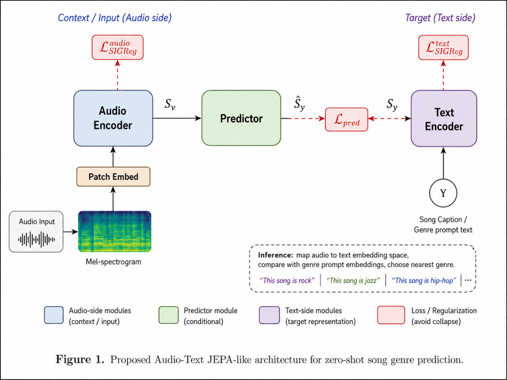

# AL-JEPA — Audio-Language Joint Embedding Predictive Architecture

**MuGen** (*mugen* — Music Genre) is a foundation audio-language model trained with a JEPA-style objective for zero-shot song genre prediction. It learns a joint embedding space between audio and text by training a conditional predictor to map audio representations to text representations — without requiring direct audio-label supervision.

---

## Architecture



The model consists of three learned components:

- **Audio Encoder** — processes raw audio via mel-spectrogram extraction and patch embedding, producing a context representation $S_y$.
- **Predictor** — a conditional network that maps audio-side embeddings to the text embedding space, producing $\hat{S}_y$.
- **Text Encoder** — encodes song captions or genre prompt text into target representations $S_y$.

Training minimizes a joint loss: an audio-side regularization term $\mathcal{L}^{\text{audio}}_{\text{SKReg}}$, a text-side regularization term $\mathcal{L}^{\text{text}}_{\text{SKReg}}$ (collapse avoidance), and the cross-modal prediction loss $\mathcal{L}_{\text{pred}}$.

At inference time, audio is embedded and mapped to the text space, then compared against genre prompt embeddings via nearest-neighbour search — enabling zero-shot genre classification without retraining.

---

## Citation

If you use this work, please cite:

```bibtex
@misc{aljepa2026,
  title   = {AL-JEPA: Audio-Language Joint Embedding Predictive Architecture for Zero-Shot Genre Prediction},
  author  = {},
  year    = {2026},
}
```

---

## License

[LICENSE](LICENSE)
